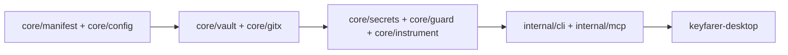

# Architecture

Top-level map of domains and layering. Agents must be able to reason about the whole
system from this document plus the code it links to.

## Business domains

| Domain | Responsibility | Code |
|--------|----------------|------|
| Vault | Encrypt, decrypt, pack, unpack the committed vault artifact | `core/vault` |
| Secrets | Manage the secret set: add, seal, restore, status, run, materialize | `core/secrets` |
| Guard | Prevent plaintext leaks into git: gitignore checks, hooks, staged scans | `core/guard` |
| Instrumentation | Write agent harness files into user repos (AGENTS.md, rules, mcp.json) | `core/instrument` |
| Access | Human and agent entry points: CLI and MCP server | `internal/cli`, `internal/mcp` |

## Layer model

Within the module, code may depend only "forward" through these layers. Anything
else is disallowed.

```
Types (core/manifest, core/config)
  -> Persistence (core/vault, core/gitx)
  -> Service (core/secrets, core/guard, core/instrument, core/keys)
  -> Runtime (internal/cli, internal/mcp, cmd/keyfarer)
  -> UI (keyfarer-desktop, separate repo, imports core/... only)
```

- Types: manifest schema, config schema. No imports outside stdlib.
- Persistence: the encrypted vault format and git plumbing.
- Service: business logic composing types and persistence.
- Runtime: cobra commands and the MCP server. Thin; no business logic.
- UI: the desktop app lives in `keyfarer-desktop` and may import only `core/...`
  packages, never `internal/...` (enforced by Go's internal package rule).



## Cross-cutting concerns

- Vault key acquisition (env var, OS credential store, key file, interactive prompt)
  goes through `core/keys.Resolver` only. No other package prompts or reads
  `KEYFARER_KEY` directly.
- All user-visible output goes through the runtime layer. Service packages return
  data and errors; they never print.

## Enforcement

- Layer direction: Go `internal/` visibility plus `go vet`; structural import test
  in `core/arch_test.go` fails with remediation instructions when a service package
  imports a runtime package or a non-vault package imports crypto primitives.
- Secret hygiene: unit tests assert error values never contain secret material.
- Knowledge base freshness: `scripts/docs-check.sh` in CI.

## Where there is freedom

Boundaries, correctness, and reproducibility are enforced centrally. How a solution
is expressed within a layer is left to the implementer. Output that is correct,
maintainable, and legible to future agent runs meets the bar.
